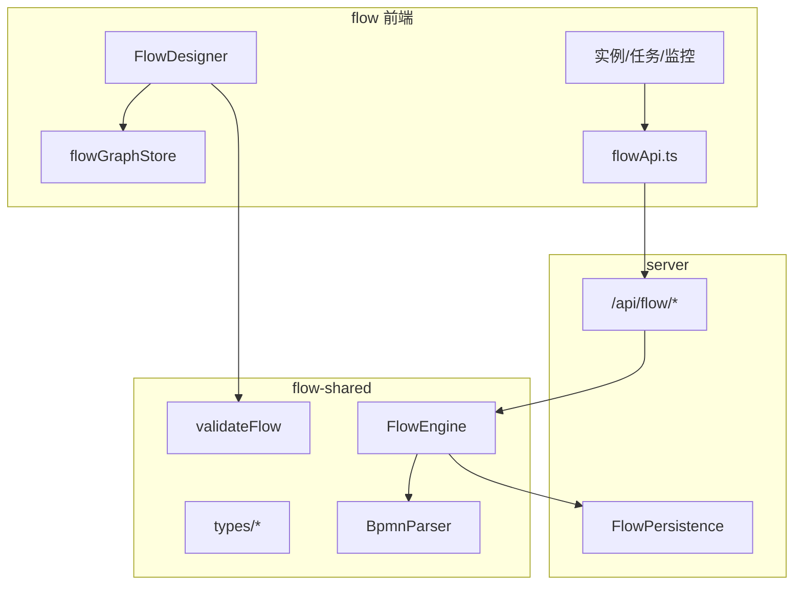

# Flow 架构文档

> `@flow` + `@schema-platform/flow-shared` — BPMN 流程设计器与执行引擎

**文档版本**：v1 (2026-07-06)

---

## 一、项目结构

```
flow/                          # 前端 UI (@flow)
├── src/
│   ├── components/            # FlowDesigner, FlowCanvas, nodes, nodePanels
│   ├── stores/                # 7 Pinia Store
│   ├── composables/           # 模拟、布局、跨节点数据
│   ├── api/flowApi.ts         # 统一 API
│   └── views/                 # 列表、实例、任务、监控

flow-shared/                   # 共享引擎 (@schema-platform/flow-shared)
├── src/types/                 # BPMN、Graph、Instance、Monitor
└── src/engine/
    ├── FlowEngine.ts          # Token 执行引擎
    ├── BpmnParser.ts
    ├── FlowValidator.ts
    └── ExpressionEvaluator.ts
```

| 包 | 端口 | 职责 |
|---|---|---|
| `@flow` | 5200 | BPMN 设计器、实例/任务 UI |
| `flow-shared` | — | 类型、校验、**服务端执行引擎** |

---

## 二、分层架构



**边界**：前端 **不** import `FlowEngine`；执行在服务端完成。

---

## 三、BPMN 节点

- **枚举**：`BpmnElementType` 25 种（flow-shared）
- **UI 实现**：13 种（面板 + 渲染器）
- **引擎执行器**：Start/End、User/Service/Script Task、三种 Gateway、Timer、SubProcess、CallActivity

类型映射：`flowGraphStore` 维护 Vue Flow type ↔ BPMN type。

---

## 四、FlowGraph 数据模型

```typescript
interface FlowGraph {
  nodes: FlowNodeData[]   // id, type, position, config: BpmnNodeConfig
  edges: FlowEdgeData[]   // source, target, condition, isDefault
  metadata?: { ... }
}
```

持久化：`FlowVersion.graph`（设计时）→ 发布后用于 `FlowEngine.startInstance`。

---

## 五、设计时 vs 运行时

| | 设计时 | 运行时 |
|--|--------|--------|
| 位置 | flow 前端 | server + flow-shared |
| 状态 | Vue Flow nodes/edges | FlowInstanceData + tokens |
| 校验 | `validateFlow` 客户端 | 引擎启动前再次校验 |
| 模拟 | `useSimulation` | 真实 API 轮询可视化 |
| 表单 | MicroFormEmbed 预览 | 任务办理 iframe |

---

## 六、Pinia Store（7 个）

| Store | 职责 |
|-------|------|
| `flowGraphStore` | nodes/edges ↔ FlowGraph 序列化 |
| `flowDesignerStore` | 选中、undo、dirty、预览模式、校验高亮 |
| `flowDefinitionStore` | 流程定义 CRUD、发布 |
| `flowInstanceStore` | 实例、任务、审批操作 |
| `flowMonitorStore` | 监控仪表盘数据 |
| `flowTemplateStore` | 流程模板 |
| `notificationStore` | 通知未读 |

---

## 七、集成

| 消费方 | 方式 |
|--------|------|
| Shell | qiankun 子应用 `flow` |
| Editor | UserTask 嵌入 PublishView；`/embed/*` |
| AI | iframe + `onAiApply` 写入 graph |
| Server | FlowEngine 执行实例 |

---

## 八、文档索引

### 设计与运行时

- [设计文档索引](./design/README.md)
- [信息架构](./design/overview.md)
- [流程设计器](./design/designer.md)
- [实例与任务](./design/instances-tasks.md)
- [**运行时架构**](./design/runtime.md)

### 项目说明

- [README](../README.md) — 功能清单与开发命令
