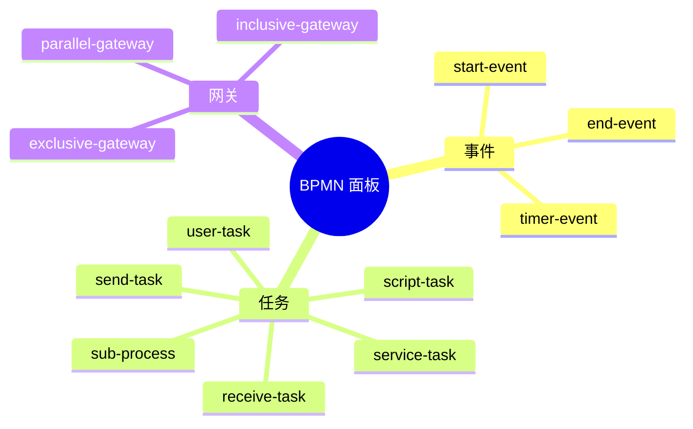
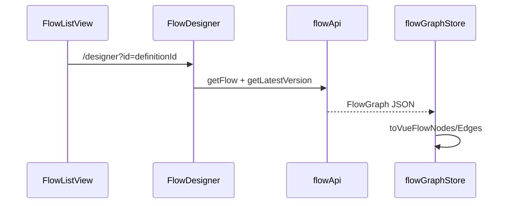
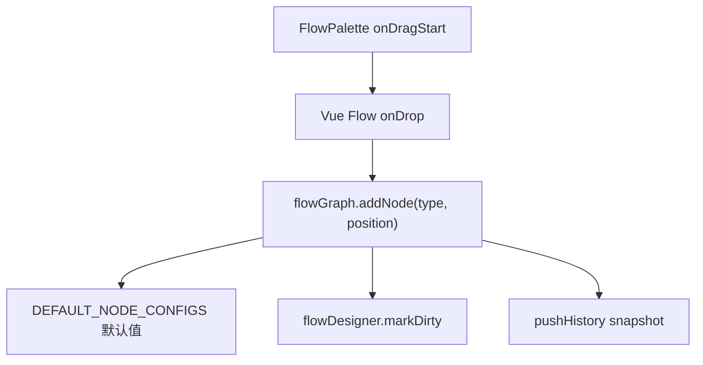
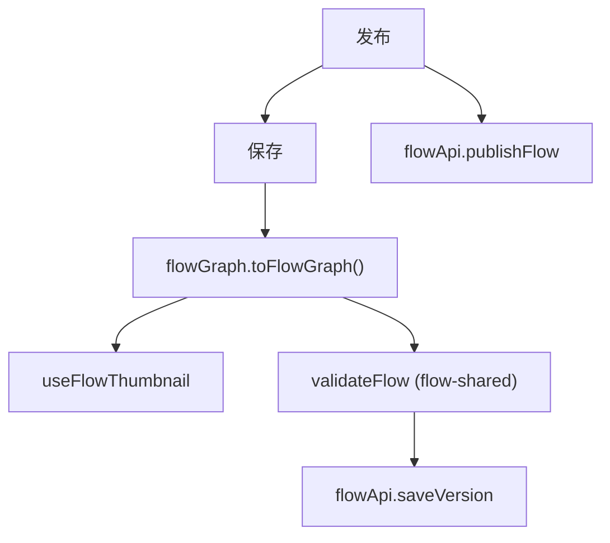
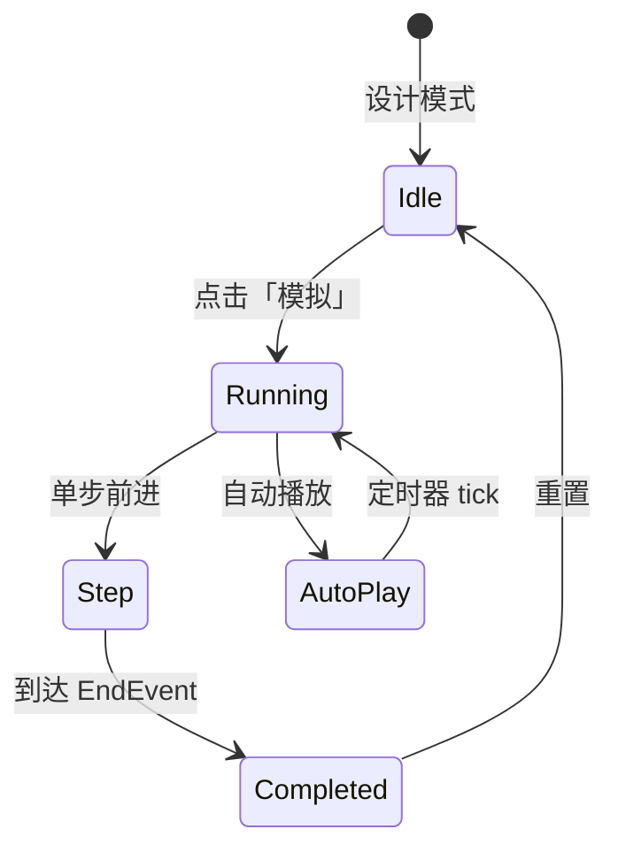
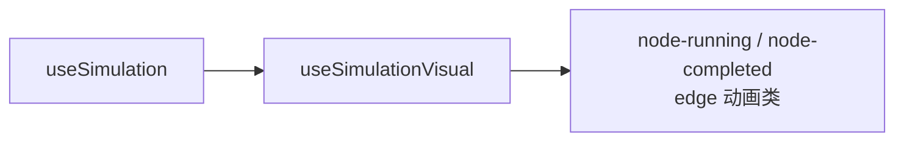
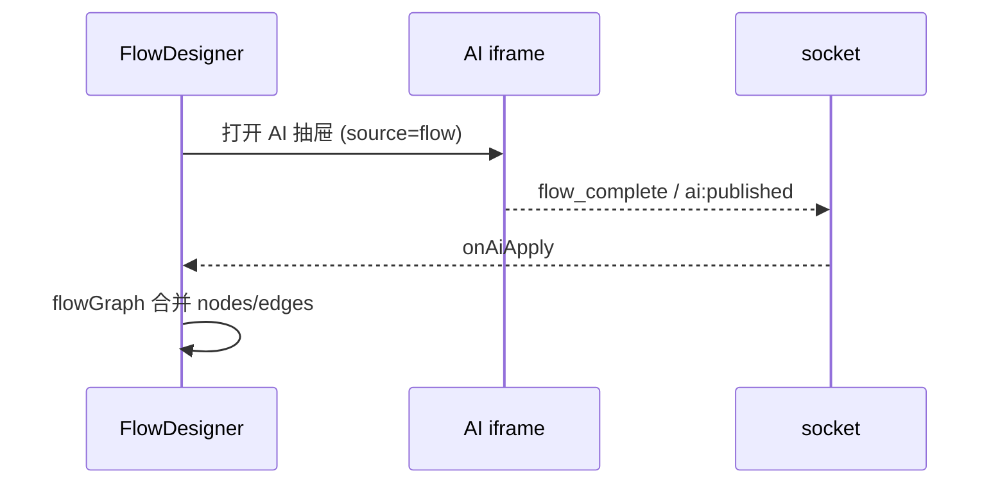

# Flow 流程设计器 — 设计稿与交互流

## 一、线框（FlowDesigner）

```
┌──────────────────────────────────────────────────────────────────────────┐
│ FlowToolbar                                                              │
│ [保存] [发布] [撤销/重做] [校验] [自动布局] [模拟▶] [导出]    流程名 [___] │
├──────────┬───────────────────────────────────────────────┬───────────────┤
│ Palette  │ FlowCanvas (Vue Flow)                         │ PropertyPanel │
│ 240px    │                                               │ 320px         │
│          │  Background + Controls + MiniMap            │               │
│ ▼ 事件   │  自定义节点 slot × 13                         │ label         │
│  开始/结束│  AnimatedEdge                               │ documentation │
│ ▼ 任务   │  snap grid                                  │ nodePanel(*)  │
│  用户/服务│                                               │ 出边条件列表  │
│ ▼ 网关   │                                               │               │
│          │                                               │               │
├──────────┴───────────────────────────────────────────────┴───────────────┤
│ 可选: AI 抽屉 (400px) | 表单预览 MicroFormEmbed                           │
└──────────────────────────────────────────────────────────────────────────┘
```

---

## 二、已实现节点（13 种）



`BpmnElementType` 枚举共 25 种，其余为向前兼容预留。

---

## 三、核心交互流

### 3.1 打开设计器



### 3.2 拖拽添加节点



### 3.3 连线

```
onConnect → flowGraph.addEdge
  → 网关出边可配置 condition / isDefault
  → AnimatedEdge 渲染
```

### 3.4 属性编辑

| 节点类型 | 面板组件 |
|----------|----------|
| `user-task` | UserTaskPanel（审批人、表单绑定、驳回策略） |
| `service-task` | ServiceTaskPanel（HTTP/API） |
| `script-task` | ScriptTaskPanel |
| `*-gateway` | GatewayConditionPanel |
| `sub-process` | SubProcessPanel |

`useNodePropertyPanel` 注册 type → panel 映射。

### 3.5 保存与发布



校验失败在 Toolbar 展示错误节点 ID 列表。

### 3.6 自动布局

```
useAutoLayout (dagre)
  → 重算 nodes position
  → fitView
```

### 3.7 设计/预览模式切换

| 模式 | 侧栏 | 画布 |
|------|------|------|
| `design` | 显示 | 可编辑 |
| `preview` | 隐藏 | 只读 |

---

## 四、模拟执行（设计时）



**注意**：模拟不调用服务端 FlowEngine，网关条件简化处理。



---

## 五、表单预览

UserTask 绑定 `formPublishId` 时：

```
PropertyPanel → 「预览表单」
  → MicroFormEmbed iframe
  → Editor /view/:publishId
  → postMessage fg:set-mode
```

---

## 六、AI 集成



---

## 七、BPMN 导入导出

```
Toolbar 导出 → exportToBpmnXml(graph)
Toolbar 导入 → importFromBpmnXml → flowGraph.load
```

由 `flow-shared` 提供，设计器内校验后写入版本。
