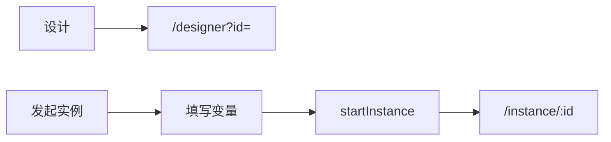
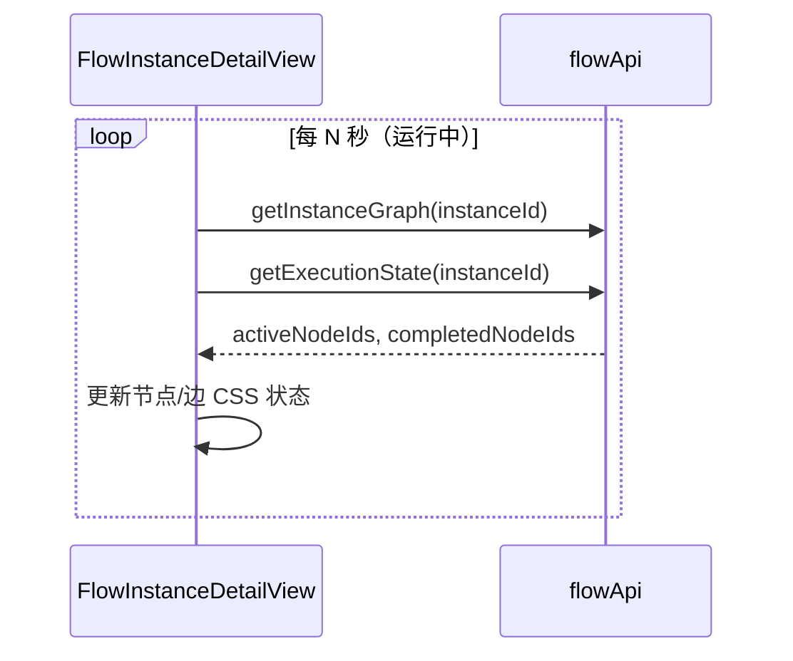
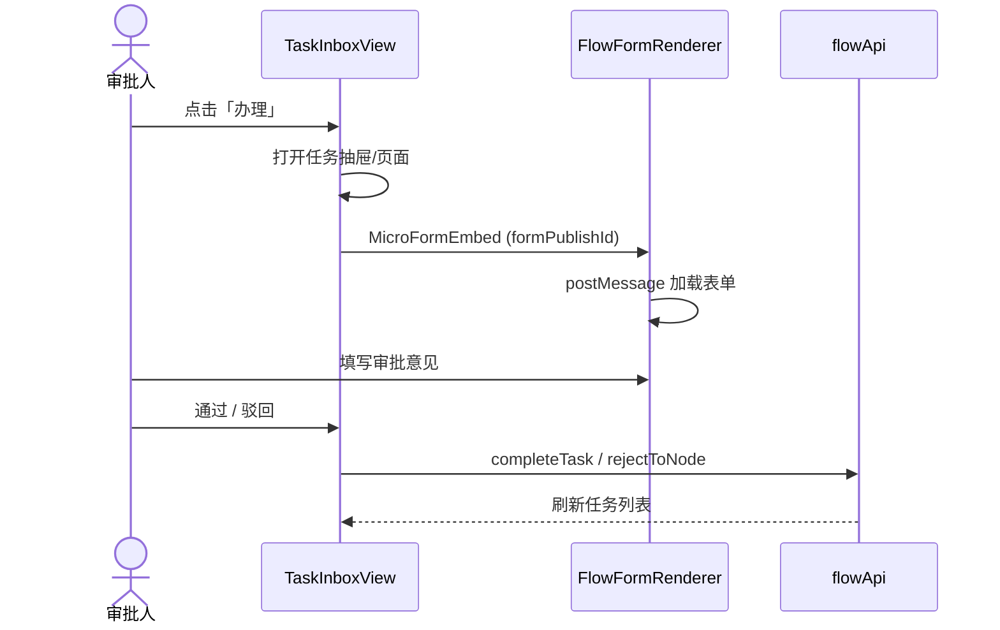
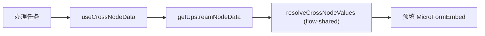
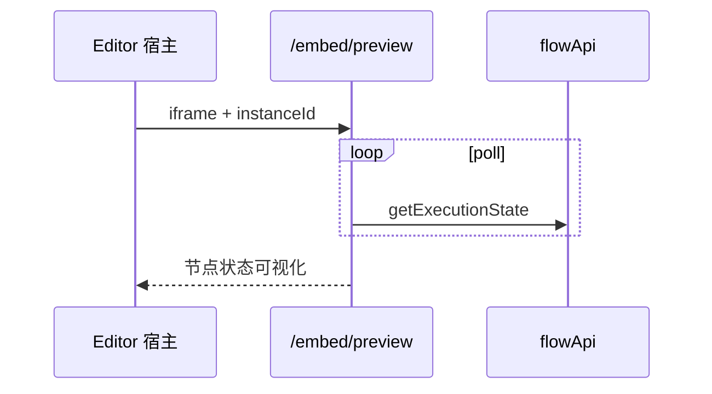
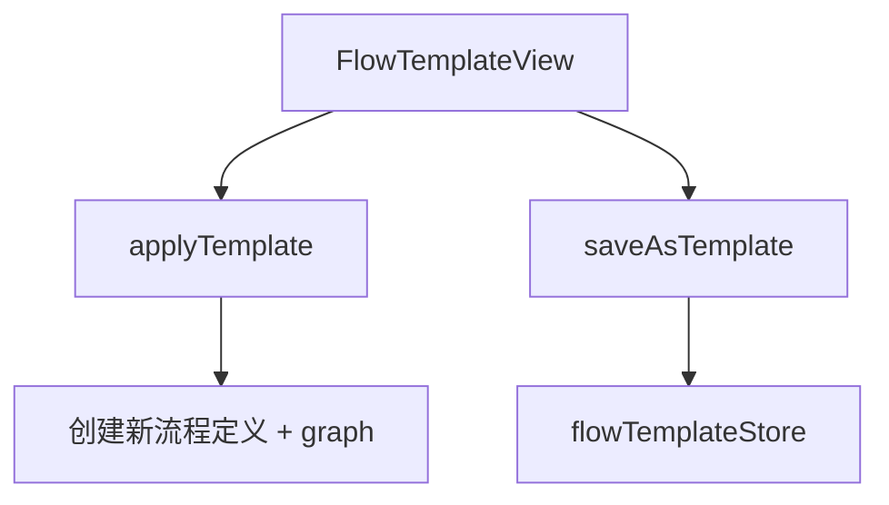

# Flow 实例与任务 — 设计稿与交互流

## 一、流程列表（FlowListView）

```
┌──────────────────────────────────────────────────────────────────────────┐
│ 流程定义                              [+ 新建] [从模板创建]               │
├──────────────────────────────────────────────────────────────────────────┤
│  名称          状态      版本      操作                                   │
│  请假审批       已发布    v3      [设计] [实例] [发布] [删除]              │
│  采购申请       草稿      v1      [设计] ...                              │
└──────────────────────────────────────────────────────────────────────────┘
```



---

## 二、实例详情线框（FlowInstanceDetailView）

```
┌──────────────────────────────────────────────────────────────────────────┐
│ ← 返回 │ 请假审批 #12345  ● 运行中  │ [终止] [挂起] [撤回]                │
├──────────────────────────────────────────────────────────────────────────┤
│                                                                          │
│   FlowGraphPreview（Vue Flow 只读）                                       │
│   节点着色: 已完成(绿) / 活动(蓝) / 等待(橙)                               │
│   边动画: edgeRuntimeState                                            │
│                                                                          │
├──────────────────────────────┬───────────────────────────────────────────┤
│ 审批日志 Timeline            │ 流程变量 JSON                             │
│ 节点耗时                     │ 刷新按钮                                  │
└──────────────────────────────┴───────────────────────────────────────────┘
```

### 运行时图轮询



**前端不执行 FlowEngine** — 状态完全来自服务端 API。

---

## 三、任务收件箱（TaskInboxView）

```
┌──────────────────────────────────────────────────────────────────────────┐
│ 我的任务                    [批量通过] [批量驳回]                          │
├──────────────────────────────────────────────────────────────────────────┤
│  Tab: [待办] [已办] [我发起的]                                             │
├──────────────────────────────────────────────────────────────────────────┤
│  ☐ 请假申请 - 部门经理审批    发起人: 张三    2小时前    [办理]            │
│  ☐ 采购单 - 财务审核          发起人: 李四    昨天      [办理]            │
└──────────────────────────────────────────────────────────────────────────┘
```

### 办理任务交互流



### 审批操作矩阵

| 操作 | API | 场景 |
|------|-----|------|
| 通过 | `completeTask` | 标准审批 |
| 驳回 | `rejectToNode` | 选择驳回目标节点 |
| 委派 | `delegateTask` | 转给他人代办 |
| 转办 | `transferTask` | 永久转移 |
| 加签 | `addApprover` | 增加审批人 |
| 减签 | `removeApprover` | 移除审批人 |
| 催办 | `urgeTask` | 通知待办人 |
| 批量 | `batchApprove` / `batchReject` | 多选操作 |

---

## 四、跨节点数据

UserTask 表单可引用上游节点字段 `{{nodeId.field}}`：



---

## 五、嵌入页（Editor / Shell）

| 路由 | 用途 |
|------|------|
| `/embed/preview` | 流程实例图嵌入预览 |
| `/embed/task/:taskId` | 单任务审批嵌入 |
| `/embed/approval-log` | 审批日志嵌入 |
| `/embed/task-list` | 任务列表嵌入 |



---

## 六、流程模板



内置模板可通过 `seedBuiltinTemplates` API 初始化。
