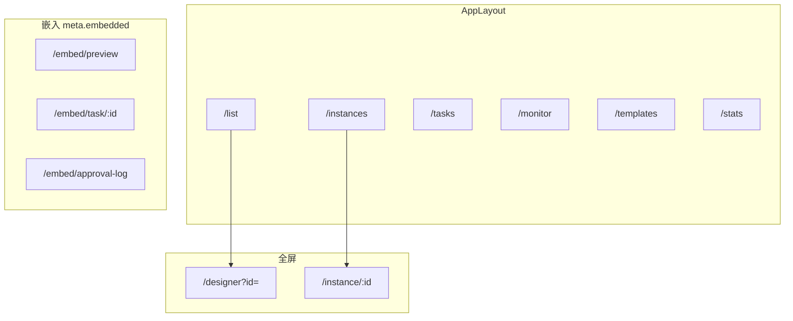
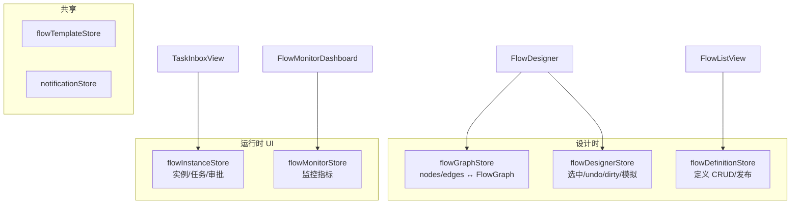
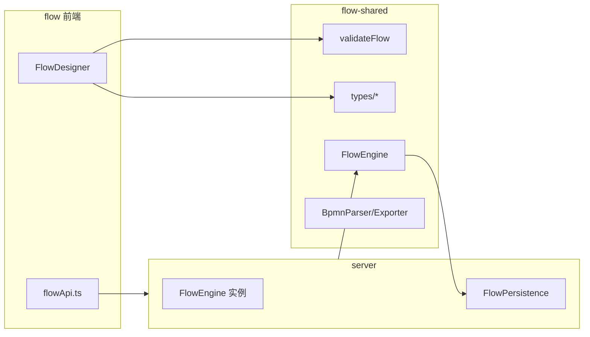

# Flow 信息架构与布局

## 一、应用壳层

### 1.1 独立模式

```
┌──────────────────────────────────────────────────────────────────────────┐
│ AppLayout                                                                │
├────────────┬─────────────────────────────────────────────────────────────┤
│ 侧栏       │  主内容区                                                    │
│            │                                                             │
│ 流程列表   │                                                             │
│ 流程实例   │                                                             │
│ 我的任务   │                                                             │
│ 流程监控   │                                                             │
│ 流程模板   │                                                             │
│ 流程统计   │                                                             │
└────────────┴─────────────────────────────────────────────────────────────┘
```

### 1.2 全屏与嵌入

| 路由 | 布局 | 用途 |
|------|------|------|
| `/designer?id=` | 全屏 | BPMN 设计器 |
| `/embed/preview` | 无侧栏 | Editor 嵌入流程预览 |
| `/embed/task/:id` | 无侧栏 | 任务审批嵌入 |
| `/embed/approval-log` | 无侧栏 | 审批日志嵌入 |

qiankun 子应用名：`flow`，开发端口 **5200**。

---

## 二、路由图



嵌入路由跳过独立鉴权，依赖宿主 token。

---

## 三、Store 关系



---

## 四、flow-shared 边界



**前端不 import FlowEngine**；仅 `validateFlow`、类型、BPMN 导入导出。

---

## 五、与 Editor / AI 集成

| 集成方 | 机制 |
|--------|------|
| Editor | UserTask `formPublishId` → iframe PublishView |
| Editor 嵌入 | `/embed/preview` 轮询 `getExecutionState` |
| AI | iframe 抽屉 + `onAiApply` 写入 graph |
| Shell | qiankun + 共享 token |

详见 [designer.md](./designer.md)、[runtime.md](./runtime.md)。
