# Flow 运行时架构

> FlowEngine Token 模型、服务端执行、前端可视化 — 设计时 vs 运行时的边界

---

## 一、运行时总览

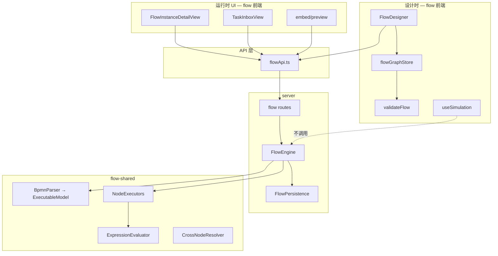

**核心原则**：`FlowEngine` 仅在 **server** 运行；前端通过 REST 驱动并可视化状态。

---

## 二、设计时 vs 运行时

| 维度 | 设计时 | 运行时 |
|------|--------|--------|
| 引擎 | `validateFlow`（客户端） | `FlowEngine`（服务端） |
| 状态 | `flowGraph` nodes/edges | `FlowInstanceData` + tokens |
| 持久化 | `FlowVersion.graph` | `FlowInstance` + `TaskInstance` |
| 模拟 | `useSimulation`（简化逻辑） | 无（用真实 API） |
| 表单 | MicroFormEmbed 预览 | 任务办理 iframe |

---

## 三、FlowEngine 执行模型

### 3.1 Token 状态机

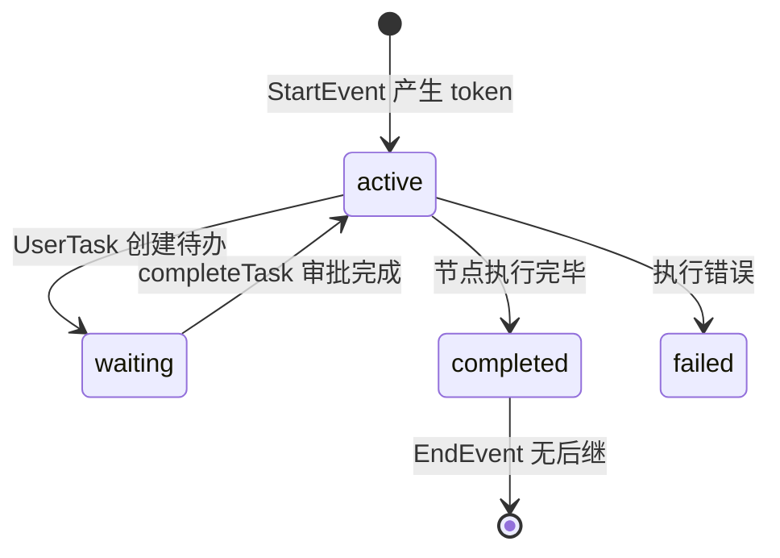

```typescript
interface FlowToken {
  id: string
  nodeId: string
  status: 'active' | 'waiting' | 'completed' | 'failed'
}
```

### 3.2 启动实例

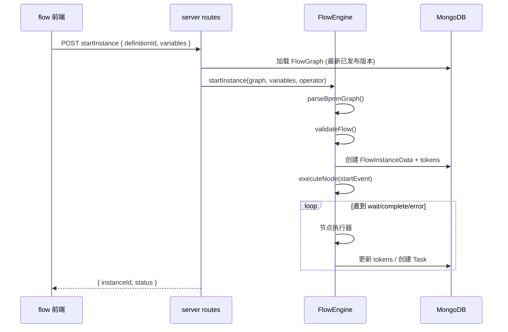

### 3.3 节点执行器

| BPMN 类型 | 执行器 | 结果 |
|-----------|--------|------|
| StartEvent | StartEventExecutor | `continue` |
| EndEvent | EndEventExecutor | `complete` |
| UserTask | UserTaskExecutor | `wait` + Task |
| ExclusiveGateway | ExclusiveGatewayExecutor | 条件选边 |
| ParallelGateway | ParallelGatewayExecutor | 多 token |
| ServiceTask | ServiceTaskExecutor | HTTP 调用 |
| ScriptTask | ScriptTaskExecutor | 表达式执行 |
| TimerEvent | TimerEventExecutor | 定时/延迟 |
| SubProcess | SubProcessExecutor | 子流程 |
| CallActivity | CallActivityExecutor | 调用外部定义 |

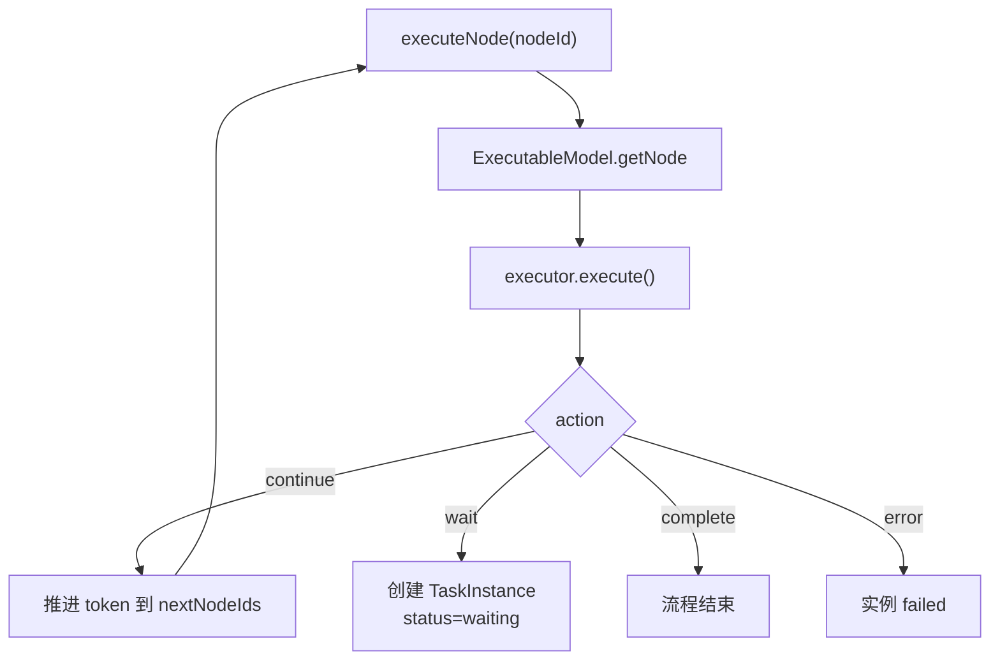

### 3.4 ExecutionContext

```typescript
interface ExecutionContext {
  instanceId: string
  variables: Record<string, unknown>      // 流程变量
  nodeFormData: Record<string, Record>      // nodeId → 表单数据
  operator?: string
  initiator?: string
}
```

生产环境使用 `variables` 对象；`VariableBus` 仅存在于测试辅助。

---

## 四、UserTask 运行时

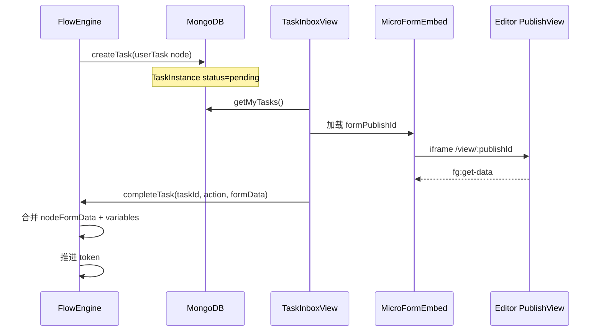

### 审批动作运行时

| action | 引擎行为 |
|--------|----------|
| approve | 完成 token，流转下游 |
| reject | `rejectToNode` 回退到指定节点 |
| delegate | 变更 assignee，保持 waiting |
| transfer | 永久变更 assignee |

---

## 五、网关运行时

### ExclusiveGateway

```
evaluateExpression(condition, variables)
  → 选第一条满足条件的出边
  → 无匹配时用 isDefault 边
```

### ParallelGateway

```
fork: 为每条出边创建 token
join: 等待所有入边 token 到齐后合并
```

### InclusiveGateway

```
满足条件的出边均创建 token（OR 语义）
```

**设计器模拟**简化上述逻辑，不执行真实表达式。

---

## 六、表达式运行时

`ExpressionEvaluator.evaluateExpression()`：

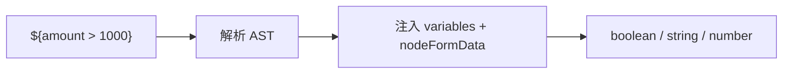

用于：网关条件、审批人表达式、ScriptTask、ServiceTask 参数模板。

---

## 七、跨节点数据运行时

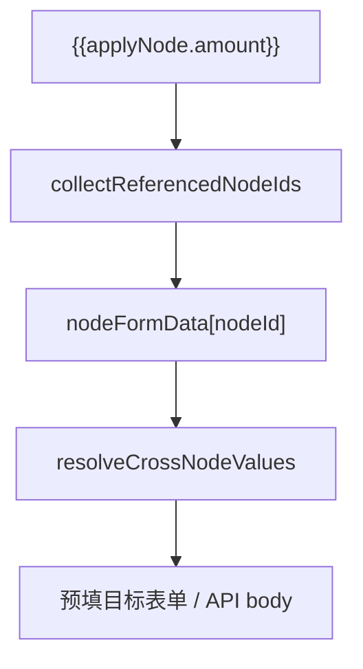

- **服务端**：`CrossNodeResolver`（flow-shared）
- **前端**：`useCrossNodeData` + `getUpstreamNodeData` API

---

## 八、前端可视化运行时

### 8.1 实例图状态 API

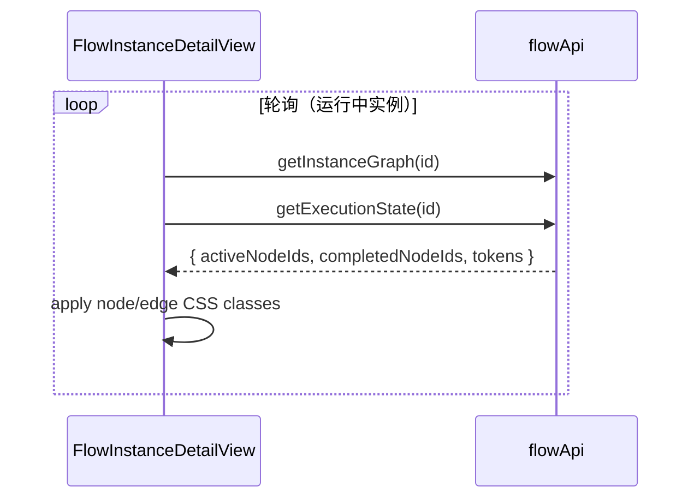

### 8.2 edgeRuntimeState

```
源节点 completed + 目标 active → 边 animated
节点 error → 边 error 样式
```

---

## 九、ServiceTask 运行时

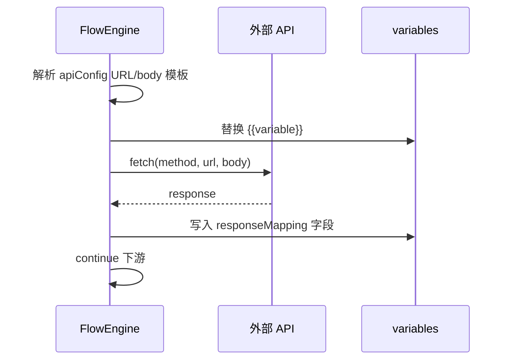

设计时：`flowRequestQueue` 预取 API 用于设计器预览（带 TTL 缓存）。

---

## 十、监控运行时

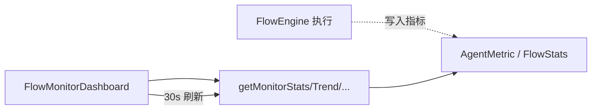

监控数据与实例执行解耦，聚合统计用。

---

## 十一、AI 运行时集成

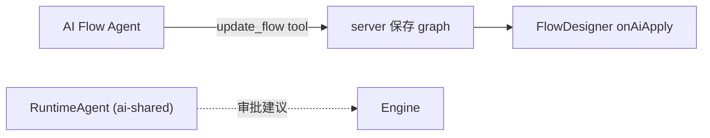

`RuntimeAgent` 供引擎回调 `onAIAssist`（服务端配置时）。

---

## 十二、约束速查

| 约束 | 说明 |
|------|------|
| 前端不 import FlowEngine | 仅 server + flow-shared 测试 |
| 模拟 ≠ 执行 | useSimulation 不走 API |
| 已发布版本执行 | startInstance 用 latest published |
| validateFlow 双端 | 设计器保存前 + 引擎启动前 |
| 13/25 节点 | UI 13 种，引擎可扩展执行器 |

---

## 相关文档

- [designer.md](./designer.md) — 设计器交互与模拟
- [instances-tasks.md](./instances-tasks.md) — 任务办理 UI
- [../architecture.md](../architecture.md) — 项目架构
- [../../flow-shared/src/engine/FlowEngine.ts](../../flow-shared/src/engine/FlowEngine.ts) — 引擎源码
